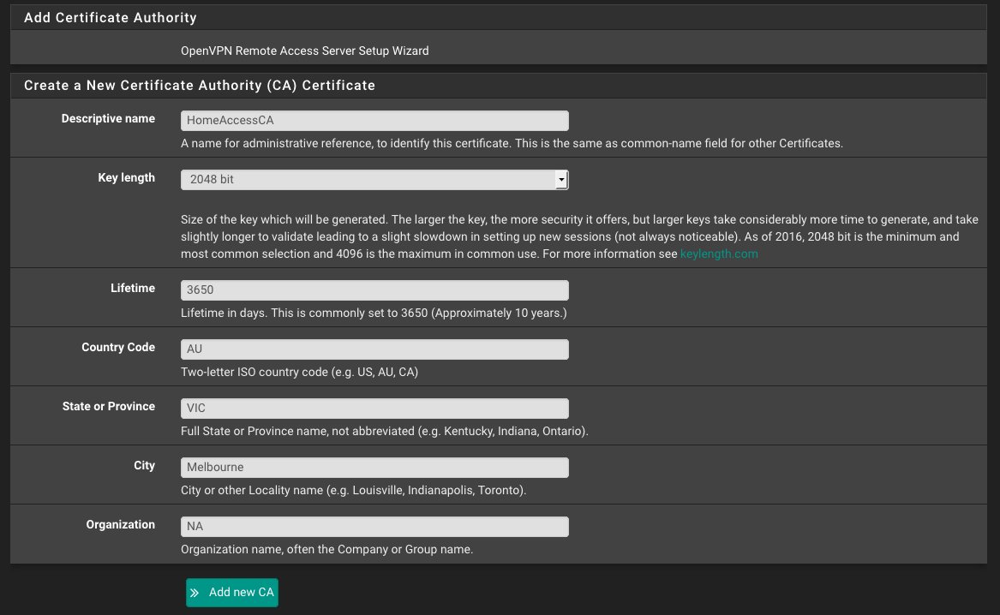

# How to configure an OpenVPN Remote Access Server in pfSense

When I'm not at university, I spend approximately 4 months of the year working interstate. Since I'm the self designated network administrator of my share house, it's important that I'm able to change the network configuration even when I'm not at home. pfSense facilitates a solution to this problem in the form of OpenVPN Support. This tutorial will describe the process of configuring OpenVPN, and is an adaptation of the [Netgate Documentation on the process](https://www.netgate.com/docs/pfsense/vpn/openvpn/openvpn-remote-access-server.html)

To start, navigate to VPN > OpenVPN > Wizards and start the Wizard.

## Authentication
Choose the desired authentication settings. For the purposes of this tutorial, we will select "Local User Access". Other options include [LDAP](https://en.wikipedia.org/wiki/Lightweight_Directory_Access_Protocol) and [RADIUS](https://en.wikipedia.org/wiki/RADIUS), however these won't be addressed here.

Choose "Local User Access", then click "Next".

## Certificate Authority Selection

Select "Add a new CA"

Fill in the following fields as appropriate:

- Descriptive Name: Used as the Common Name (CN) for the Certificate Authority (CA). Don't use any spaces, punctuation or special characters. I've chosen "HomeAccessCA"
- Key Length: Default is OK; higher is better but it will use more CPU. I've selected 2048 for this.
- Lifetime: The lifetime of the CA in days. Default is OK; It can be lowered but this will mean you go through this process more frequently. I've chosen 3650.
- Country Code, State or Province, City, Organization: Enter information as appropriate.

Select "Add new CA"

## Server Certificate Selection

Select "Add new Certificate"

Fill in the following fields as appropriate. This is largely the same as the previous step, with a change in the descriptive name. The values I've used are shown below:

Select "Create new Certificate"

## General OpenVPN Server Information

- Interface: This is the interface where OpenVPN will listen for incoming connections, typically your WAN.
- Protocol: Your choices here are to select either TCP or UDP. Each has their own benefits, and the choice between them will depend on your specific needs. A brief summary of the practical differences between these protocols will be shown below. For now, select "UDP on IPv4 only".
- Local Port: Default is 1194. Use the default unless you have reason not to.
- Description: Provide a name for the OpenVPN instance for administrative purposes. I've chosen "Home Access VPN".

### [TCP vs UDP](https://www.bestvpn.com/guides/openvpn-tcp-vs-udp-difference-choose/)

#### TCP
- Better Reliability: The TCP packet includes an error correction header, and guarantees delivery of data. The flipside to these benefits is that there is a considerable overhead both in terms of size and speed as packet receipt needs to be acknowledged, retransmitted as appropriate and re-acknowledged etc.
- Bypass Firewalls: When operated on port 443, TCP is almost indisitinguishable from a HTTPS SSL conection, making it very difficult to block, as identifying the connection as VPN and not SSL traffic is itself very difficult.
- Slower Speed: As mentioned previously, these benefits have the overhead of slower speeds and larger packet sizes

#### UDP
- Faster Speed: UDP packets are much smaller than TCP packets and can be transmitted much faster, making this protocol the preferred method for QoS traffic such as VoIP, streaming media, gaming etc.
- Lower Reliability: UDP packets don't contain the same error correcting headers, which makes it faster at the expense of reliability. A packet may not reach its destination in the form it was sent, and has to be retransmitted. UDP does not guarantee delivery of packets.

As general advice, use UDP unless you have issues or a specific reason to use TCP.

## Cryptographic Settings

- TLS Authentication: Leave this checked. This mitigates against OpenSSL attacks such as Heartbleed.
- Generate TLS Key: Leave this checked, unless you already have a key you want to use.
- TLS Shared Key: Leave blank unless you already have a key you want to use, in which case paste it here.
- DH Parameters Length: The default is 2048. This is a common selection as of 2016. Larger keys will provide more security, however will take considerably more time to generate and slow the connection down.
- Encryption Algorithm: There are a number of options you can select here. I will address some of the differences between the block ciphers for AES. You'll have to do your own research for the others!
	- [CBC (Cipher Block Chaining)](https://en.wikipedia.org/wiki/Block_cipher_mode_of_operation#Cipher_Block_Chaining_(CBC)): Uses previous block ciphertext to XOR with next block plaintext. This creates a dependence between blocks such that if any block has been altered, decryption won't be possible.
	- [CFB (Cipher Feedback)](https://en.wikipedia.org/wiki/Block_cipher_mode_of_operation#Cipher_Feedback_(CFB)): Similar to CBC, except each blocks ciphertext is encrypted before the XOR operation with the nextblocks plaintext to generate its ciphertext. Creates a dependence between each block such that decryption isn't possible if a block is altered.
	- [OFB (Output Feedback)](https://en.wikipedia.org/wiki/Block_cipher_mode_of_operation#Output_Feedback_(OFB)): The input vector of each block is encrypted and then forms the next blocks input vector. Each encrypted input vector is XOR'd with each block plaintext to produce ciphertext. This creates a psuedorandom input vector for each block and preserves dependency between each block. This has the advantage of being able to pregenerate the keystream, however there will be a cycle in the psuedo random input vector. Practically however, this period is likely to be very large.
	- [GCM (Galois/Counter Mode)](https://en.wikipedia.org/wiki/Galois/Counter_Mode): Efficient and performant block cipher due to it's ability to leverage parallel processing. 

	A more detailed analysis of each of these block ciphers can be found [here](http://web.cs.ucdavis.edu/~rogaway/papers/modes.pdf).

	In equivalent systems, GCM has performance improvements of 5-6x over CBC, and so would be my recommendation all else being equal. Having said that, one thing to consider is what algorithms have hardware acceleration support for your hardware. My system uses the Intel Atom E3845, which provides hardware acceleration for RSA, DSA, DH, AES-128-CBC, AES-192-CBC, and AES-256-CBC. Unfortunately no GCM. To quantify the difference that this makes, you can utilise openssl from the command line interface. ssh into your router and give the following commands:

		$ openssl speed -evp aes-256-cbc
		$ openssl speed -evp aes-256-gcm

	Then compare the output. My results are below:

	[Insert openssl comparison screenshot - openssl-output.jpg]

	As you can see, hardware acceleration makes a reasonably large impact, as AES-256-CBC is approximately 5 times faster than AES-256-GCM; an inversion of what we would expect if all things were equal.

	TLDR; Select what's appropriate for your system, I've selected AES-256-CBC 

- Auth Digest Algorithm: The default setting here is SHA1, which has been [deprecated as of 2016](https://blog.qualys.com/ssllabs/2014/09/09/sha1-deprecation-what-you-need-to-know). My understanding is that this field is ignored if you selected a GCM encryption algorithm as the GCM algorithm incorporates integrity checking into the encryption/decryption process, however if you chose a method that *is* reliant on the auth digest algorithm, ensure that you select *at least* SHA256. [BlueKrypt](https://www.keylength.com/en/3/) suggest that this is sufficient for near term protection (up to 2028). I've selected SHA512, which [BlueKrypt suggest is sufficient for long term protection (through to 2068)](http://www.ecrypt.eu.org/csa/documents/D5.4-FinalAlgKeySizeProt.pdf).

- Hardware Crypto: Select this if you have it! I've selected "BSD cryptodev engine".

## Tunnel Settings

- Tunnel Network: This should be a new, unique network that does not exist anywhere in the current network or routing table. I've selected 192.168.70.0/24
- Redirect Gateway: Force all client generated traffic through the tunnel. Checking this depends on your use case. If you want to route all of your remote traffic through your home server, check this. This was not particularly important to me as the primary purpose of this is remote access to configure the network, so I left this unchecked.
- Local Network: This is the network that will be accessible from the remote endpoint, expressed as a CIDR range. My LAN is on subnet 30, so I entered 192.168.30.0/24. 
- Concurrent Connections: Specify the number of clients allowed to concurrently connect to this server. I left this blank.
- Compression: Select "Omit Preference (Use OpenVPN Default)"
- Type-of-Service: Leave unchecked
- Inter-Client communication: I checked this as I wanted to be able to administer my home servers remotely, but use your best judgement for your purposes.
- Duplicate Connections: Leave this unchecked unless you have good reason to check it.

## Client Settings

- Dynamic IP: Checked
- Topology: Select "Subnet -- One IP address per client in a common subnet"
- DNS Default Domain: Leave Blank
- DNS Server 1: Set to google DNS 8.8.8.8

Leave the rest blank, or populate as it suits your scenario.

Select "Next"

## Firewall Rule Configuration

- Firewall Rules: Checked
- OpenVPN Rule: Checked

These will automatically add the necessary rules to the firewall to allow these connections. 

Select "Next"
Now you've finished the wizard. Click "Finish" to complete.

The result of this is that firewall rules have been added for the WAN and OpenVPN interfaces (See these at Firewall > Rules). Verify that you had the following rules added:

## Adjustments
Some settings are not presented in the wizard but are a better fit for some situations than the defaults chosen by the wizard. Navigate to VPN > OpenVPN > Servers and select the "Edit" icon for the server you just created. The biggest one to look for is the "Server Mode" setting. The default setting for this is "Remote Access (SSL/TLS + User Auth)", however there are a couple of other Remote Access alternatives:

- Remote Access (SSL/TLS + User Auth)

	- Requires both certificates *and* username/password
	- Each user has a unique client configuration that includes their personal certificate and key
	- Most secure as there are multiple factors of authentication (TLS Key and Certificate that the user has, and the username/password they know)

- Remote Access (SSL/TLS)

	- Certificates only, no auth
	- Each user has a unique client configuration that includes their personal certificate and key
	- Useful if clients should not be prompted to enter a username and password
	- Less secure as it relies only on something the user has (TLS key and certificate)

- Remote Access (User Auth)

	- Authentication only, no certificates
	- Useful if the clients should not have individual certificates
	- Commonly used for external authentication (RADIUS, LDAP)
	- All clients can use the same exported client configuration and/or software package
	- Less secure as it relies on a shared TLS key plus only something the user knows (username/password)

I have "Remote Access (SSL/TLS + User Auth)" selected. Confirm that the rest of the settings are accurate, and press "Save".

## Add User Certificates 

- Navigate to System > User Manager
- Click "+Add" to add a new user
- Populate the "Username", "Password", and "Full Name" fields
- Check the "Click to create a user certificate" check box.
- Enter the username in the "Descriptive name" field
- Select the correct certificate authority, in my case this was "HomeAccessCA"
- Key Length: 2048 bits
- Lifetime 3650
- Click "Save"

This process can also be completed for existing users in a similar fashion

## Install the OpenVPN Client Export Package

- Navigate to System > Packages > Available Packages
- Find "openvpn-client-export" in the list, and install.

## Export the configuration

- Navigate to VPN > OpenVPN > Client Export
- Choose the VPN from the "Remote Access Server" Dropdown
- Select the options as appropriate for your needs in the upper sections. The defaults are typically OK
- Find the user in the list at the bottom of the page, and select the appropriate configuration type to export

This will look like this:

I use a MacBook Pro along with [Tunnelblick](https://tunnelblick.net/downloads.html). Tunnelblick prefers the configuration file as a .ovpn file, so I download the "Viscosity Inline Config" option. Depending on your client and it's configuration requirements, this may change for you.

## Assigning Users a Static IP
To assign a user a static IP, navigate to VPN > OpenVPN > Client Specific Overrides and press "Add"

- Select the VPN Server from the Server List
- Enter the username as the "Common Name"
- Enter the desired IP and netmask for "IPv4 Tunnel Network": I entered 192.168.70.10/24 for my user
- Leave the rest blank and press "Save"

This is useful if you need to add users to an IP access list.

And you're done! You should now be able to connect to your home network remotely, using a secure VPN.

To disclaim this guide somewhat, I am by no means a security expert and this guide only reflects my own best understanding at the time of writing. Make sure you do your own research to confirm what works best for your situation. Additionally, if you have found something that's inaccurate in my post, please leave a comment and I'll update it as soon as I can!
